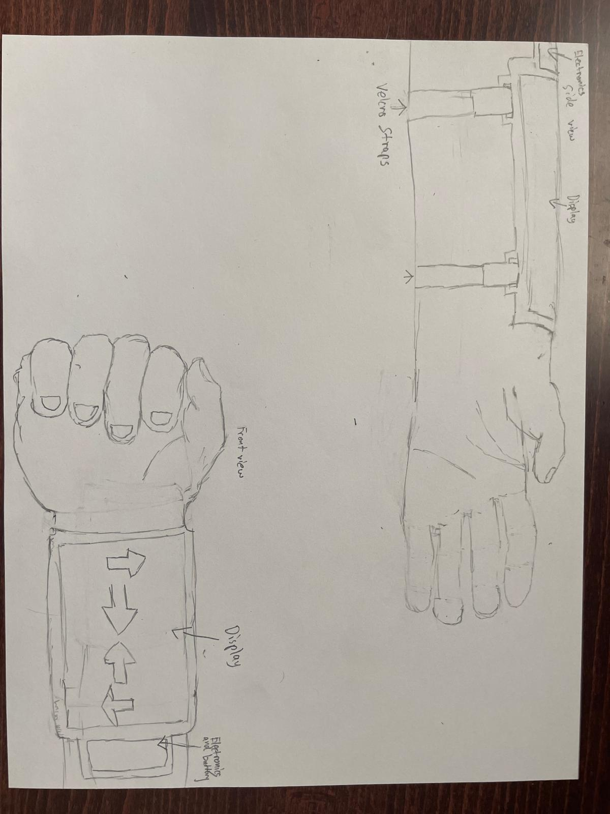

#  Swipe Band  
A wearable armband game powered by ESP32 and a flexible display

 <!-- Optional: replace with your image -->

## 📖 Overview
**Swipe Band** is a lightweight wearable game system built around an **ESP32** microcontroller and a **flexible OLED/TFT display**.  
The game challenges players to **swipe in the direction of on-screen arrows** as quickly and accurately as possible. Designed as both a **tech demo** and a **fun wearable gadget**, Swipe Band combines gesture interaction, compact electronics, and playful gameplay in a sleek armband form.

---

## ✨ Features
- 🧠 **ESP32-powered** — runs the entire game logic locally  
- 🖼️ **Flexible or curved display** — mounted on an armband for comfort and style  
- ✋ **Swipe detection** via capacitive touch panel or IMU-based gestures  
- ⚡ **Lightweight UI** built with `TFT_eSPI` for fast rendering  
- 🔋 **Battery-powered** for portable gameplay on the go

---

## 🧱 Hardware Components
| Component                        | Description                                     |
|-----------------------------------|-------------------------------------------------|
| 🧠 ESP32-S3 / ESP32 Dev Board      | Main microcontroller (Wi-Fi + BLE capable)     |
| 🖼️ Flexible OLED or TFT display    | SPI-based, 1.3"–2.0" recommended               |
| ✋ FT6206 Capacitive Touch Panel  | Detects swipes and taps                        |
| 🔋 Li-Po Battery (500–1000 mAh)   | Portable power supply                          |
| 🔌 TP4056 Charging Module        | For battery charging via USB                   |

> Optional: A small accelerometer/IMU can be added to detect wrist flick gestures.

---

## 🔌 Wiring
| Display / Touch | ESP32 Pin |
|------------------|-----------|
| VCC              | 3.3V     |
| GND              | GND      |
| SCL / CLK        | GPIO 18  |
| SDA / MOSI       | GPIO 23  |
| CS               | GPIO 5   |
| DC               | GPIO 2   |
| RST              | GPIO 4   |
| Touch SCL/SDA    | GPIO 21/22 (I²C) |

> ⚠️ Adjust pin numbers based on your chosen ESP32 board and display module.

---

## 🧠 Software
The project uses the **Arduino framework** with the following libraries:

- [TFT_eSPI](https://github.com/Bodmer/TFT_eSPI) — for display rendering  
- [Adafruit FT6206](https://github.com/adafruit/Adafruit_FT6206_Library) — for capacitive touch  
- (Optional) [Adafruit Unified Sensor](https://github.com/adafruit/Adafruit_Sensor) — for IMU input

### 🛠️ Installation
1. Install [Arduino IDE](https://www.arduino.cc/en/software)  
2. Add **ESP32 boards** through the Board Manager  
3. Install required libraries via Library Manager  
4. Clone this repository:
   ```bash
   git clone https://github.com/yourusername/swipe-band.git
