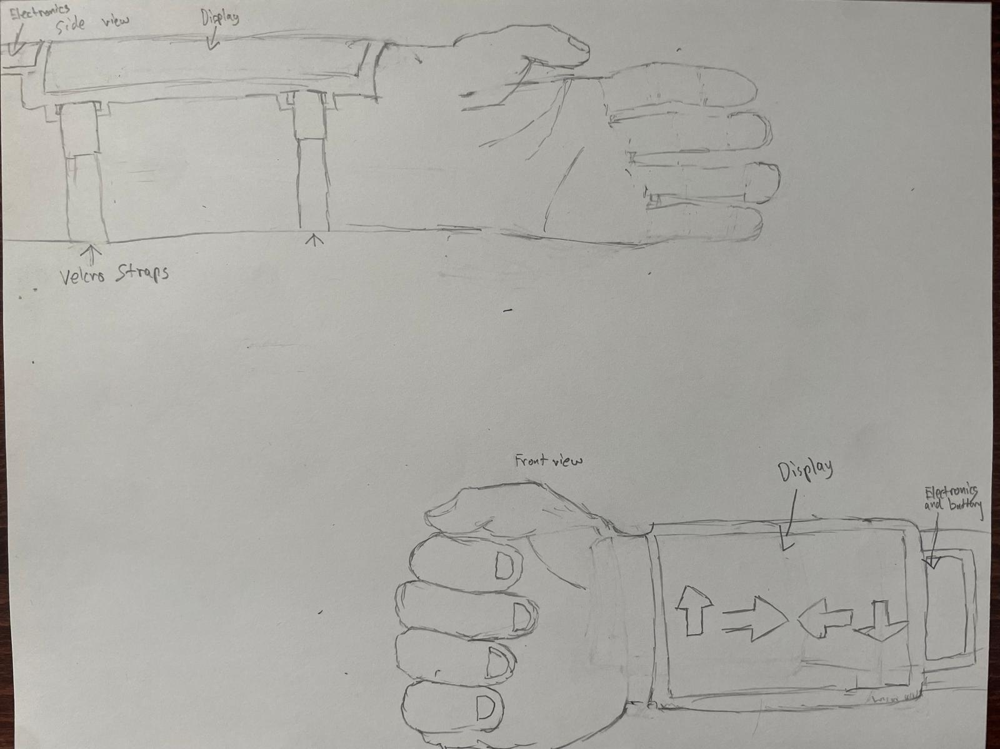

#  Swipe Band  
A wearable armband game powered by Uno R3 Board and a flexible display

 <!-- Optional: replace with your image -->

##  Overview
**Swipe Band** is a lightweight wearable game system built around an **ESP32** microcontroller and a **flexible OLED/TFT display**. The game challenges players to **swipe in the direction of on-screen arrows** as quickly and accurately as possible. This is inspired by the HellDivers 2 Strategem call downs. To call down a strategem in Hell Divers the player must enter a combination of arrow keys which then would activate the ability. In the game the player does this on a arm mounted screen. 

---

## Features
- *Nano V3 powered** — runs the entire game logic locally  
-  **Flexible or curved display** — mounted on an armband for comfort and style  
- **Swipe detection** via capacitive touch panel or IMU-based gestures  
- **Battery-powered** for portable gameplay.
- **Interchangable size** - the band uses velcro strips that can be changed to fit any arm size. 

---

##  Hardware Components
| Component                        | Description                                     |
|-----------------------------------|-------------------------------------------------|
| Nano V3.0 Board     | Main microcontroller      |
|TFT Touch Screen LCD   | SPI-based, 3"              |
| Li-Po Battery (500–1000 mAh)   | Portable power supply                          |
|Black Filament| To print out case|
|Sand Paper| To post proccess print|

---
